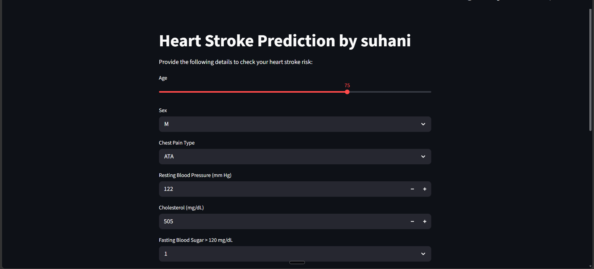
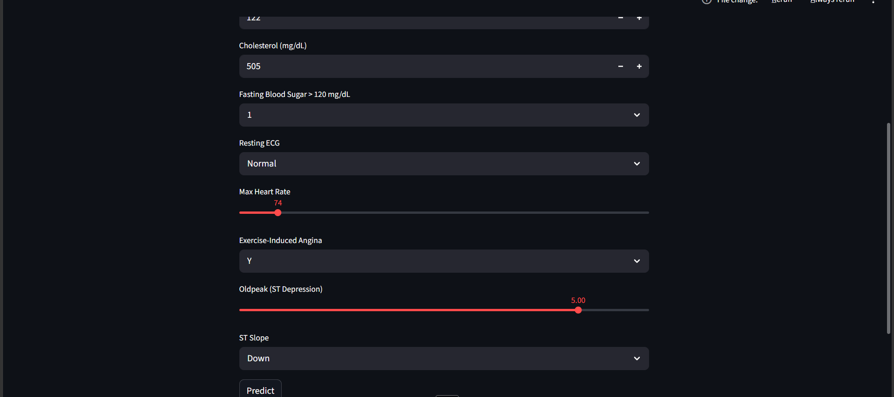
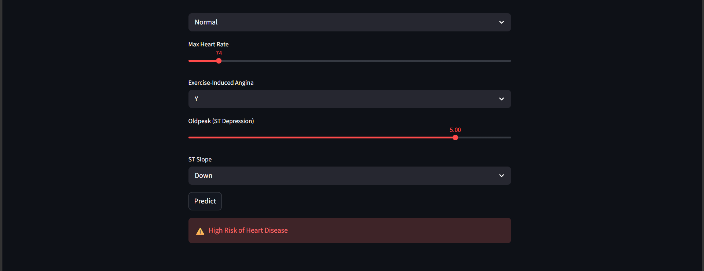

# ❤️ Heart Disease Prediction System

A Machine Learning web application that predicts the likelihood of heart disease based on patient health parameters.

Built using:
- Python
- Scikit-Learn
- Pandas
- NumPy
- Streamlit

---

## 📌 Project Overview

This project uses a Machine Learning model trained on heart disease data to predict whether a patient is at **high risk** or **low risk** of heart disease.

Users can enter medical details such as:

- Age
- Gender
- Chest Pain Type
- Resting Blood Pressure
- Cholesterol
- Fasting Blood Sugar
- ECG Results
- Maximum Heart Rate
- Exercise-Induced Angina
- Oldpeak
- ST Slope

The system processes the inputs and predicts the risk level instantly.

---

## 🚀 Features

✅ User-friendly Streamlit interface

✅ Real-time prediction

✅ Data preprocessing and scaling

✅ Logistic Regression model

✅ One-hot encoded categorical features

✅ Model and scaler saved using Joblib

✅ Easy deployment using Streamlit

---

## 🛠️ Tech Stack

| Technology | Purpose |
|------------|----------|
| Python | Core Programming |
| Pandas | Data Processing |
| NumPy | Numerical Operations |
| Scikit-Learn | Machine Learning |
| Joblib | Model Persistence |
| Streamlit | Web Application |

---

## 📊 Dataset

The project uses a Heart Disease dataset containing patient medical information and corresponding heart disease diagnosis labels.

Target Variable:

- 0 → Low Risk
- 1 → High Risk

---

## ⚙️ Machine Learning Pipeline

### Data Preprocessing

- Missing value handling
- One-hot encoding
- Feature scaling using StandardScaler

### Model Training

- Logistic Regression

### Evaluation Metrics

- Accuracy Score
- F1 Score

Model Accuracy:

```text
89%
```

---

## 📷 Application Screenshots

### Home Page



### Prediction Example


### High Risk Result


---

## 📂 Project Structure

```text
Heart_Disease_Prediction/
│
├── app.py
├── heart_model.pkl
├── heart_scaler.pkl
├── heart_columns.pkl
├── requirements.txt
│
├── screenshots/
│   ├── home.png
│   ├── prediction.png
│   └── high-risk.png
│
└── README.md
```

---

## ▶️ Installation

Clone the repository:

```bash
git clone https://github.com/yourusername/Heart_Disease_Prediction.git
```

Move into project directory:

```bash
cd Heart_Disease_Prediction
```

```

Run the application:

```bash
streamlit run app.py
```

---

## 📈 Future Improvements

- Random Forest and XGBoost comparison
- Probability-based risk scoring
- Explainable AI (SHAP)
- Model deployment on Streamlit Cloud
- User history tracking
- PDF medical report generation

---

## 🎯 Learning Outcomes

Through this project I learned:

- Data preprocessing
- Feature engineering
- Machine Learning workflows
- Model serialization using Joblib
- Streamlit application development

---

## 👩‍💻 Author

**Suhani Vyas**

B.Tech Computer Science Student

Aspiring AI Engineer specializing in Generative AI

GitHub: https://github.com/vyass4747-lab